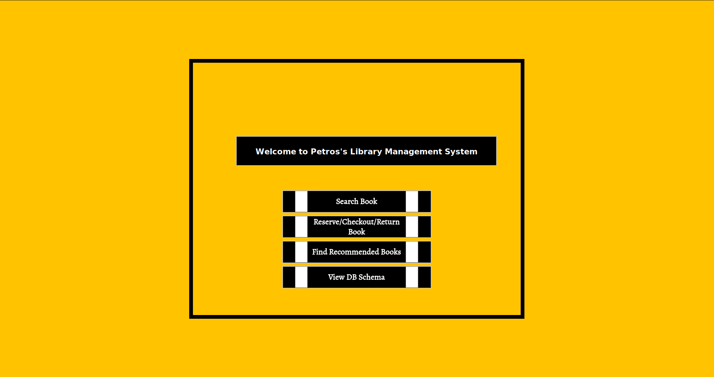
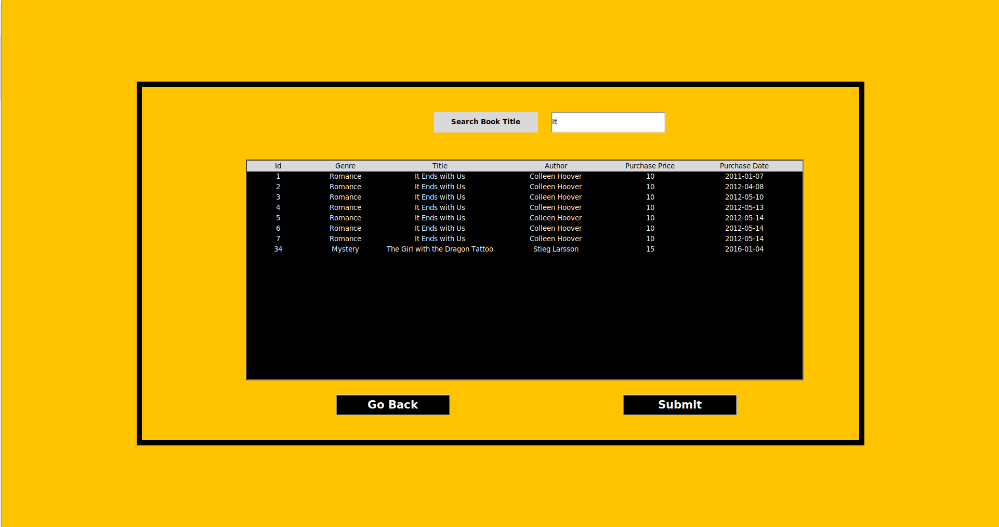
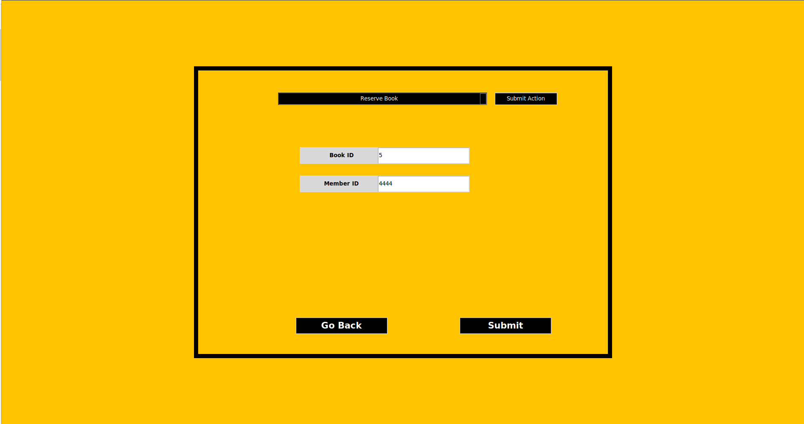
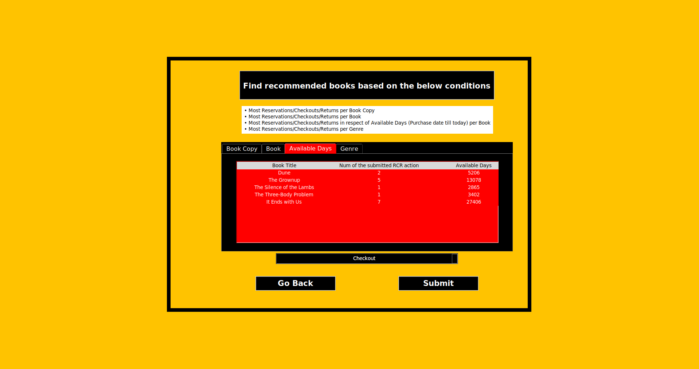
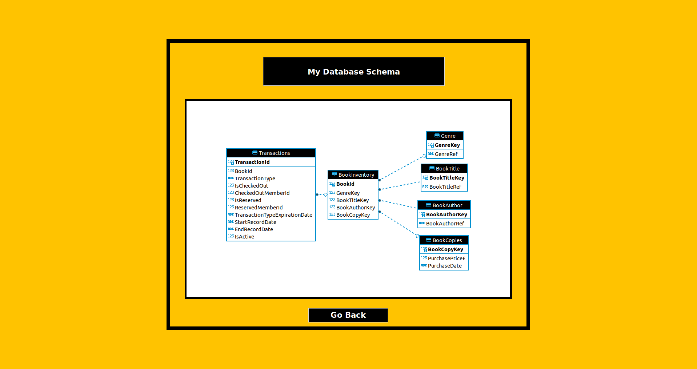

## 📰 Description
- Wrote a library management system for a librarian 
- The librarian can:
  * reserve books
  * check available books out
  * return any books they currently have 
- Details of all books in the library are stored in a local SQLite database
- For each book the following information is stored: 
  * title
  * author
  * genre
  * purchase price 
  * purchase date
  * a unique ID number which can be used to identify different copies of the same book 


## :volcano: GUI 
<table>
  <tr>
    <td></td>
    <td align="center">MENU page</td>
    <td></td>
    <td></td>
  </tr>
  <tr>
  <td></td>
      <td></td>
  <td></td>
  <td></td>
  </tr>

  <tr>
    <td align="center">SEARCH BOOK page</td>
    <td align="center">RCR page</td>
    <td align="center">REC page</td>
  </tr>
  <tr>
    <td></td>
    <td></td>
    <td></td>
  </tr>

  <tr>
    <td></td>
    <td align="center">DB SCHEMA page</td>
    <td></td>
    <td></td>
  </tr>
  <tr>
    <td></td>
    <td></td>
    <td></td>
    <td></td>
  </tr>
 </table>


## Outcomes
- The GUI's window is dynamic; it gets increased or decreased in size automatically
- Loaded text files using the pandas 'to_sql' method
- Followed STAR schema
- Created fact tables and dimension tables dynamically (look at the "create_dimension_table" function in the "database.py" file)
- Mapped values to ids dynamically for assigning them as keys to tables (look at the "map_vals_to_ids" function in the "database.py" file)
- Created reusable code for the widgets; for example, the two buttons on the bottom of each page, "Go Back" and "Submit", can be added by calling the "create_bottom_button_widgets" method; the same applies to the entry and label widgets ("create_label_entry_widgets" method).
- Instead of destroying the frame of each page by doing:
```
def destroy_page_widgets(self):
  for i in self.master.winfo_children():
    i.destroy()
```
Or even instead of having just one frame, I am having a single frame for each page where each is hidden and turned to visible again when appropriate (see at "show_frame" and "hide_frame" methods in the "gui.py" file)
- Created images using draw.io in combination with GIMP software and added them to Tkinter buttons
- No point in writing dot code for visualising the ERD diagram of my DB. Used DBeaver software to generate the diagram automatically and made the images transparent using the GIMP software
- Autocomplete of suggested book titles feature added to the "Search Book" page using the ttkwidgets library
- Added an option for finding the most Reservations/Checkouts/Returns (a.k.a. RCR) in respect of the most available days of the book. In other words, I find all the copies of that particular book and sum all the available dates (the date that book copy was purchased till today's date) using the JULIANDAY function and then based on the RCR (one of the three actions that the user chose), I find which book has been more popular. See the "most_rcr_available_days" method in the "BookSelect.py" and "self.available_days_flag == True" in the "Treeview.py" file for a better understanding


## Errors
For some reason, my notebook tab of showing the available days, which requires division using the operand '/' (self.data.sort(key=lambda elem: (elem[2] / elem[1]))) works fine on Linux but leads to errors on Windows. Nevertheless, no big deal. There are another three notebook tabs to play with if you are on Windows.


## Notes
- If you want to check if the normalization happens, which would require changing some data values in the txt files, make sure the DB file is deleted
before running the program again, as it won't load the changes. The reason is that I am checking if the DB exists, and in case it does,
then I skip the loading part since it only needs to be loaded once. In case of loading the DB every single time the program runs, then the data would always be overwritten, and the user's changes would always be lost after the end of a session
- Documentation for what each line of the ERD diagram represents added in the ./data/imgs directory
- On my recommendation page, it can be noticed that the TransactionType of "Return" books happened much more than the "Checkout" TransactionType. That's because of the initial data in the txt files. However, the whole procedure is correct, I just tried to make the initial data as challenging as possible so my program could meet all conditions. The explanation behind it will be stated in the "The logic behind Transactions Table" section below


## The logic behind the Transactions Table
The below logic applies to the load of the files since the procedure of Reserving, Checking Out, and Returning via the GUI is much simpler as the user decides which TransactionType wants to move forward with. On the other hand, in the case of the txt files, I had to understand which TransactionType was, based on the below conditions:

1. When Reserve, Checkout and Return happen at the same time, then it's considered as a Checkout, and both ReservedMemberId and CheckedOutId are the given ID.
2. In case of Reserve and Checkout happening at the same time, then:
  - if the Reserve Date is more recent than the Checkout Date, then the TransactionType is Reserve as somebody tried to reserve a book while it was still checked out.
  - otherwise, it is considered a Checkout, and my program looks to see if there was a previous transaction;
    In case there was, then it adds the previous transaction's member ID to:
     * the current transaction's ReservedMemberId if the current transaction is Checkout
     * the current transaction's CheckedOutMemberId if the current transaction is Reserve
3. In case Checkout and Return happened at the same time, then it is considered as Return and the CheckoutMemberId is the one given
4. In case, it was only Reserve, then  the TransactionType is Reserve and ReserveMemberId is the one given
5. In case it was only Checkout, then the TransactionType is Checkout and CheckoutMemberId is the one given


## Future Work
- Add a vertical scroll bar to the TreeView widget for better UX, but nevertheless, the user can still scroll without one
- There is only one thing I would change in my DB Schema. The book copies are currently all in the BookInventory table, whereas the BookCopies table adds another 2 columns to the BookInventory. That's silly, and I should have noticed it earlier. In reality, BookInventory should have only had one book from all the series of copies, and all the copies should have been in the BookCopies table
To complete this task, I need to make the following changes:
1. the BookCopyKey FK needs to be removed from the BookInventory table
2. a new PK needs to be created in the BookCopies table for tracking each book copy
3. BookId needs to be set as FK to the BookCopies table
- Add functionality that will check for expiration dates since I have already set expiration dates for people who reserve or checkout a book (reservation can last for 10 days while checkout for 30 days)
- EndRecordDate of the transaction has been added to the Transactions table. I would add the new transaction's date as the EndRecordDate of the previous transaction. In other words, when a new transaction comes in, the previous transaction should close; have an end date. It's a simple task as how to add it is already implemented using the "fill_new_fields" method in the "database.py" file
- Update the column header of "Num of submitted RCR action" of the Treeview in the Notebook tab in the recommendation page based on the submitted RCR action. For example, if Return is submitted, the column header of the Treeview should be "Num of Returns"; same applies for Reserve and Return actions
- The transaction of Reserve/Checkout/Return in the "bookReserve.py" & "bookCheckout.py" & "bookReturn.py" files use the 'to_sql' method where I just append the last transaction to the table (a dataframe of just one row). However, for some reason it takes ages for just one row to be added to SQLite (it takes around 5 mins). Nevertheless, I am printing the row in the console for confirmation.


## Environment
### How to set up a virtual environment on Windows:
```
cd .\LibraryManagementSystem\
python -m venv .venv (To create virtual environment)
.venv\Scripts\activate (Activate virtual environment)
pip install -r requirements.txt (Install all required packages)
```

### In case your Windows OS is not well set-up, do the following:
Add the following environment variables in the Path of *User variables for user*:
```
C:\Users\user\AppData\Local\Programs\Python\Python<yourpythonversion>\Scripts  (e.g. C:\Users\user\AppData\Local\Programs\Python\Python39\Scripts)
C:\Users\user\anaconda3
C:\Users\user\anaconda3\Scripts
C:\Users\user\anaconda3\Library\bin
```

Add the following environment variables in the *System Variables*:
```
C:\Users\user\AppData\Local\Programs\Python\Python<yourpythonversion>  (e.g. C:\Users\user\AppData\Local\Programs\Python\Python39)
```

### How to set up a virtual environment on Linux:
You should create a virtualenv with the required dependencies by running
```
make virtualenv
```

How to activate the virtual environment:
```
source ./.env/bin/activate
```

When a new requirement is needed you should add it to `unpinned_requirements.txt` and run
(this ensures that all requirements are pinned and work together for ensuring reproducibility)
```
make update-requirements-txt
```


### How to play around with my db on Linux:
```
sudo apt install sqlite3
./LibraryManagementSystem/data
sqlite3 library.db
```


## :whale: Docker
### How to run the Tkinter app in a Docker container on Linux:
But before doing so, run the application just once on your Linux OS; so the DB can be created as the Docker container to get up will need to mount the DB. If the DB does not exist, it will lead to errors
```
xhost +
sudo apt-get install x11-xserver-utils (Haven't included it in the requirements.txt as pip cannot find a matching distribution for this package)
docker-compose up
```


## 🛠 Initialization & Setup
#### Clone the repository
    git clone https://github.com/pedroandreou/LibraryManagementSystem.git


## Author
<a href="https://www.linkedin.com/in/petrosandreou80/">
  
</a>
